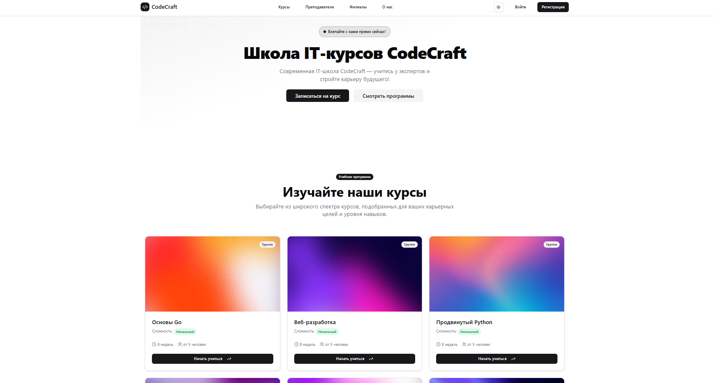

# МГТУ им. Н.Э. Баумана — Курсовая работа на тему "Информационная система компьютерных курсов"

## Видео

<!--  -->

<video src="https://github.com/maxcore25/bmstu-it-courses/blob/main/assets/CodeCraft.mp4" 
  controls 
  width="600">
</video>

## Инструкция

1. Чтобы запустить бекенд, читайте README.md в `/backend`
2. Чтобы запустить фронтед, читайте README.md в `/frontend`

## Скриншоты

### Логин

### Админка

